# wgo Tutorial

A step-by-step tutorial for [wgo](https://github.com/dmundt/wgo), the Go port
of [WireViz](https://github.com/wireviz/WireViz). Adapted from the
[WireViz tutorial](https://github.com/wireviz/WireViz/tree/master/tutorial);
the diagrams in this directory were generated with wgo.

Each example is a `.yml` file in this directory. Generate every output with:

```
wgo -f ghtsp tutorial01.yml
```

(`g`=gv, `h`=html, `p`=png, `s`=svg, `t`=tsv). The diagrams linked below are
`tutorialNN.png`; the bill of materials is `tutorialNN.bom.tsv`.

## 01 - Bare-bones example

* Minimum working example
* Only 1-to-1 sequential wiring


```yaml
connectors:
  X1:
    pincount: 4
  X2:
    pincount: 4

cables:
  W1:
    wirecount: 4
    length: 1

connections:
  -
    - X1: [1-4]
    - W1: [1-4]
    - X2: [1-4]
```

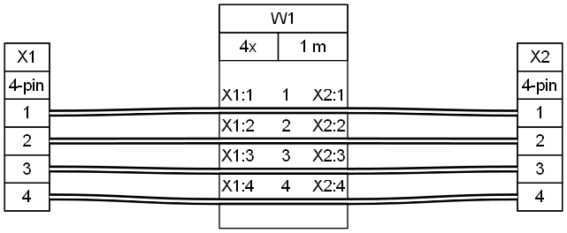

[Source](tutorial01.yml) - [Bill of Materials](tutorial01.bom.tsv)


## 02 - Adding parameters and colors

* Parameters for connectors and cables
* Auto-calculate equivalent AWG from mm2
* Non-sequential wiring


```yaml
connectors:
  X1:
    pincount: 4
    # More connector parameters:
    type: Molex KK 254
    subtype: female
  X2:
    pincount: 4
    type: Molex KK 254
    subtype: female

cables:
  W1:
    wirecount: 4
    # more cable parameters:
    length: 1
    gauge: 0.25 mm2
    show_equiv: true # auto-calculate AWG equivalent
    colors: [WH, BN, GN, YE]

connections:
  -
    - X1: [1-4]
    - W1: [1-4]
    # non-sequential wiring:
    - X2: [1,2,4,3]
```

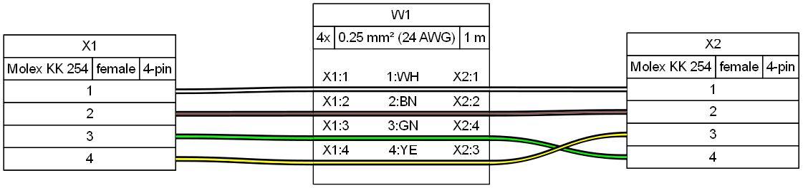

[Source](tutorial02.yml) - [Bill of Materials](tutorial02.bom.tsv)


## 03 - Pinouts, shielding, templates (I)

* Connector pinouts
  * Pincount implicit in pinout
* Cable color codes
* Cable shielding, shield wiring
* Templates


```yaml
connectors:
  X1: &template1 # define a template for later use
    pinlabels: [GND, VCC, RX, TX] # pincount implicit in pinout
    type: Molex KK 254
    subtype: female
  X2:
    <<: *template1 # reuse template

cables:
  W1:
    wirecount: 4
    length: 1
    gauge: 0.25 mm2
    show_equiv: true
    color_code: DIN # auto-assign colors based on DIN 47100
    shield: true # add cable shielding

connections:
  -
    - X1: [1-4]
    - W1: [1-4]
    - X2: [1,2,4,3]
  - # connect the shielding to a pin
    - X1: 1
    - W1: s
```

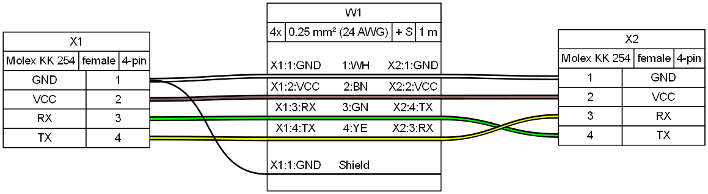

[Source](tutorial03.yml) - [Bill of Materials](tutorial03.bom.tsv)


## 04 - Templates (II), notes, American standards, daisy chaining (I)

* Overriding template parameters
* Add nodes to connectors and cables
* American standards: AWG gauge and IEC colors
* Linear daisy-chain
  * Convenient for shorter chains


```yaml
connectors:
  X1: &template_con
    pinlabels: [GND, VCC, SCL, SDA]
    type: Molex KK 254
    subtype: male
    notes: to microcontroller # add notes
  X2:
    <<: *template_con # use template
    subtype: female   # but override certain parameters
    notes: to accelerometer
  X3:
    <<: *template_con
    subtype: female
    notes: to temperature sensor

cables:
  W1: &template_cbl
    wirecount: 4
    length: 0.3
    gauge: 24 AWG # specify gauge in AWG directly
    color_code: IEC # IEC 62 colors also supported
    notes: This cable is a bit longer
  W2:
    <<: *template_cbl
    length: 0.1
    notes: This cable is a bit shorter

connections:
  -
    - X1: [1-4]
    - W1: [1-4]
    - X2: [1-4]
  - # daisy chain connectors (in line)
    - X2: [1-4]
    - W2: [1-4]
    - X3: [1-4]
```

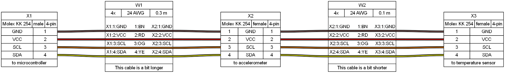

[Source](tutorial04.yml) - [Bill of Materials](tutorial04.bom.tsv)


## 05 - Ferrules, wire bundles, custom wire colors

* Ferrules
  * Simpler than connectors
  * Compact graphical representation
  * Only one pin, only one connection, no designator
  * Define once, auto-generate where needed
* Wire bundles
  * Internally treated as cables
  * Different treatment in BOM: Each wire is listed individually
  * Represented with dashed outline
* Custom wire colors
  * Wirecount can be implicit in color list


```yaml
connectors:
  X1:
    pinlabels: [+12V, GND, GND, +5V]
    type: Molex 8981
    subtype: female
  F1:
    style: simple
    type: Crimp ferrule
    subtype: 0.5 mm²
    color: OG # optional color

cables:
  W1:
    category: bundle # bundle
    length: 0.3
    gauge: 0.5 mm2
    colors: [YE, BK, BK, RD] # custom colors, wirecount is implicit

connections:
  -
    - F1. # a new ferrule is auto-generated for each of the four wires
    - W1: [1-4]
    - X1: [1-4]
```

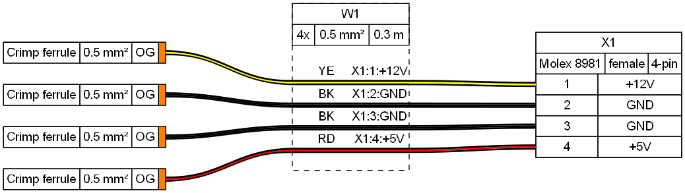

[Source](tutorial05.yml) - [Bill of Materials](tutorial05.bom.tsv)


## 06 - Custom ferrules

* Custom ferrules
  * Allows attaching more than one wire to a ferrule
  * Requires defining them as regular connectors with unique designators, adding `category: ferrule` parameter


```yaml
connectors:
  X1:
    pinlabels: [+12V, GND, GND, +5V]
    type: Molex 8981
    subtype: female
  F_10: # this is a unique ferrule
    style: simple
    type: Crimp ferrule
    subtype: 1.0 mm²
    color: YE # optional color
  F_05: # this is a ferrule that will be auto-generated on demand
    style: simple
    type: Crimp ferrule
    subtype: 0.5 mm²
    color: OG

cables:
  W1:
    category: bundle # bundle
    length: 0.3
    gauge: 0.5 mm2
    colors: [YE, BK, BK, RD] # custom colors, wirecount is implicit

connections:
    -
      - [F_05., F_10.F1, F_10.F1, F_05.]
      - W1: [1-4]
      - X1: [1-4]
```

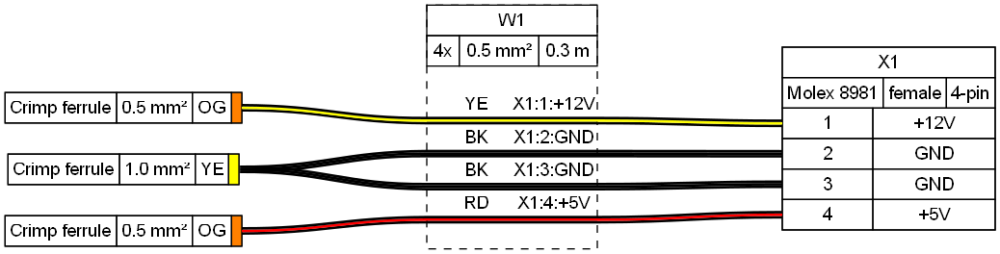

[Source](tutorial06.yml) - [Bill of Materials](tutorial06.bom.tsv)


## 07 - Daisy chaining (II)

* Zig-zag daisy chain
  * Convenient for longer chains


```yaml
connectors:
  X1: &template_con
    type: Molex KK 254
    subtype: female
    pinlabels: [GND, VCC, SCL, SDA]
  X2:
    <<: *template_con
  X3:
    <<: *template_con
  X4:
    <<: *template_con
  X5:
    <<: *template_con
  X6:
    <<: *template_con

cables:
  W1: &template_wire
    gauge: 0.25 mm2
    length: 0.2
    colors: [TQ, PK, YE, VT]
    category: bundle
  W2:
    <<: *template_wire
  W3:
    <<: *template_wire
  W4:
    <<: *template_wire
  W5:
    <<: *template_wire

connections:
  -
    - X1: [1-4]
    - W1: [1-4]
    - X2: [1-4]
  -
    - X3: [1-4]
    - W2: [1-4]
    - X2: [1-4]
  -
    - X3: [1-4]
    - W3: [1-4]
    - X4: [1-4]
  -
    - X5: [1-4]
    - W4: [1-4]
    - X4: [1-4]
  -
    - X5: [1-4]
    - W5: [1-4]
    - X6: [1-4]
```

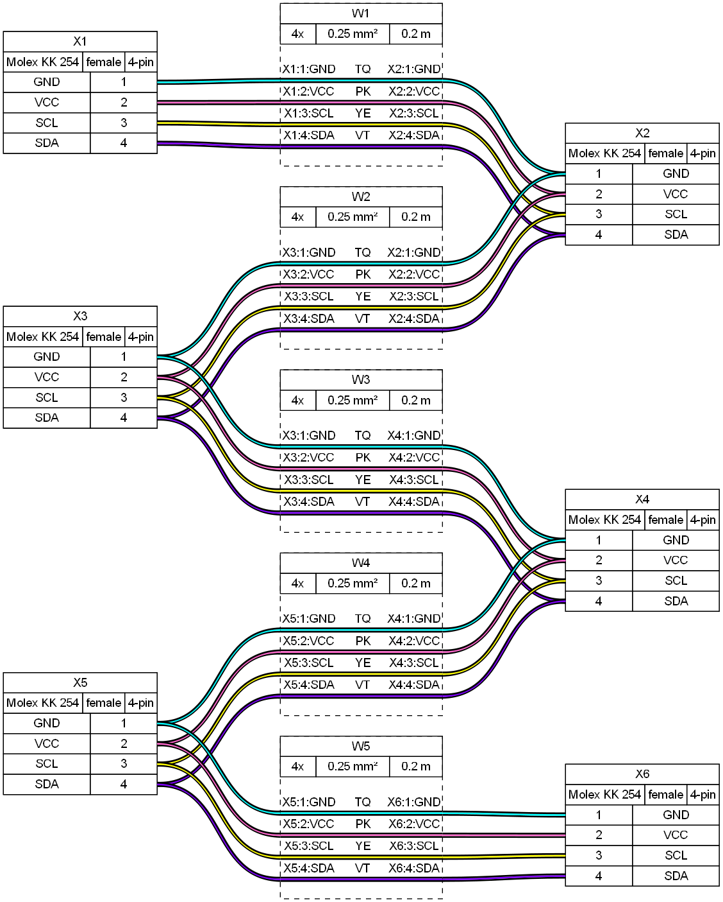

[Source](tutorial07.yml) - [Bill of Materials](tutorial07.bom.tsv)


## 08 - Part numbers and additional components

* Part number information can be added to parts
  * Only provided fields will be added to the diagram and bom
* Bundles can have part information specified by wire
* Additional parts can be added to components or just to the bom
  * quantities of additional components can be multiplied by features from parent connector or cable


```yaml
options:
  mini_bom_mode: false

connectors:
  X1: &template1 # define a template for later use
    type: Molex KK 254
    pincount: 4
    subtype: female
    manufacturer: '<a href="https://www.molex.com/">Molex</a>' # set manufacter name
    mpn: '<a href="https://www.molex.com/molex/products/part-detail/crimp_housings/0022013047">22013047</a>' # set manufacturer part number
    supplier: Digimouse
    spn: 1234
    # add a list of additional components to a part (shown in graph)
    additional_components:
      - type: Crimp # short identifier used in graph
        subtype: Molex KK 254, 22-30 AWG # extra information added to type in bom
        qty_multiplier: populated # multipier for quantity (number of populated pins)
        manufacturer: Molex # set manufacter name
        mpn: 08500030 # set manufacturer part number
      - type: Test
        qty: 1
        pn: ABC
        manufacturer: Molex
        mpn: 45454
        supplier: Mousikey
        spn: 9999
  X2:
    <<: *template1 # reuse template
    pn: CON4 # set an internal part number for just this connector
  X3:
    <<: *template1 # reuse template

cables:
  W1:
    wirecount: 4
    length: 1
    gauge: 0.25 mm2
    color_code: IEC
    manufacturer: CablesCo
    mpn: ABC123
    supplier: Cables R Us
    spn: 999-888-777
    pn: CAB1
  W2:
    category: bundle
    length: 1
    gauge: 0.25 mm2
    colors: [YE, BK, BK, RD]
    manufacturer: [WiresCo, WiresCo, WiresCo, WiresCo] # set a manufacter per wire
    mpn: [W1-YE, W1-BK, W1-BK, W1-RD]
    supplier: [WireShack, WireShack, WireShack, WireShack]
    spn: [1001, 1002, 1002, 1009]
    pn: [WIRE1, WIRE2, WIRE2, WIRE3]
    # add a list of additional components to a part (shown in graph)
    additional_components:
      - type: Sleve # short identifier used in graph
        subtype: Braided nylon, black, 3mm # extra information added to type in bom
        qty_multiplier: length # multipier for quantity (length of cable)
        unit: m
        pn: SLV-1

connections:
  - - X1: [1-4]
    - W1: [1-4]
    - X2: [1-4]
  - - X1: [1-4]
    - W2: [1-4]
    - X3: [1-4]

additional_bom_items:
  - # define an additional item to add to the bill of materials (does not appear in graph)
    description: Label, pinout information
    qty: 2
    designators:
      - X2
      - X3
    manufacturer: '<a href="https://www.bradyid.com">Brady</a>'
    mpn: '<a href="https://www.bradyid.com/wire-cable-labels/bmp71-bmp61-m611-tls-2200-nylon-cloth-wire-general-id-labels-cps-2958789">B-499</a>'
    pn: Label-ID-1
```

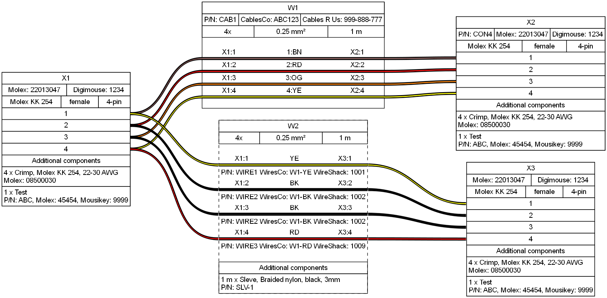

[Source](tutorial08.yml) - [Bill of Materials](tutorial08.bom.tsv)


## 09 - Connection types

* `con-cbl-con` — connector - cable - connector (the standard, see 01)
* `con-cbl` — connector - cable, cable end unterminated
* `cbl-con` — cable - connector, cable start unterminated
* `fer-cbl` — ferrule - cable, cable end unterminated
* `cbl-fer` — cable - ferrule, cable start unterminated

For the ferrule types, a new ferrule is auto-generated for each wire, in both
directions.

These cover the remaining connection topologies from the upstream tutorial
TODO list.


```yaml
connectors:
  X1:
    type: Molex KK 254
    subtype: female
    pincount: 4
  X2:
    type: Molex KK 254
    subtype: male
    pincount: 4
  F1:
    style: simple
    type: Crimp ferrule
    subtype: 0.5 mm²
    color: YE

cables:
  W1: # con-cbl-con: terminated at both ends
    wirecount: 4
    length: 0.5
    gauge: 0.25 mm2
    color_code: DIN
  W2: # cbl-con: free start, terminated at X2
    wirecount: 2
    length: 0.3
    gauge: 0.25 mm2
    colors: [RD, BK]
  W3: # con-cbl: terminated at X1, free end
    wirecount: 2
    length: 0.3
    gauge: 0.25 mm2
    colors: [GN, YE]
  W4: # fer-cbl: ferrule at the start, free end
    wirecount: 2
    length: 0.2
    gauge: 0.25 mm2
    colors: [BU, BN]
  W5: # cbl-fer: free start, ferrule at the end
    wirecount: 2
    length: 0.2
    gauge: 0.25 mm2
    colors: [RD, GN]

connections:
  -
    # con-cbl-con
    - X1: [1-4]
    - W1: [1-4]
    - X2: [1-4]
  -
    # cbl-con (the cable is not connected at its start)
    - W2: [1-2]
    - X2: [1,2]
  -
    # con-cbl (the cable is not connected at its end)
    - X1: [1,2]
    - W3: [1-2]
  -
    # fer-cbl (the cable is not connected at its end)
    # a new ferrule is auto-generated for each wire
    - F1.
    - W4: [1-2]
  -
    # cbl-fer (the cable is not connected at its start)
    # a new ferrule is auto-generated for each wire
    - W5: [1-2]
    - F1.
```

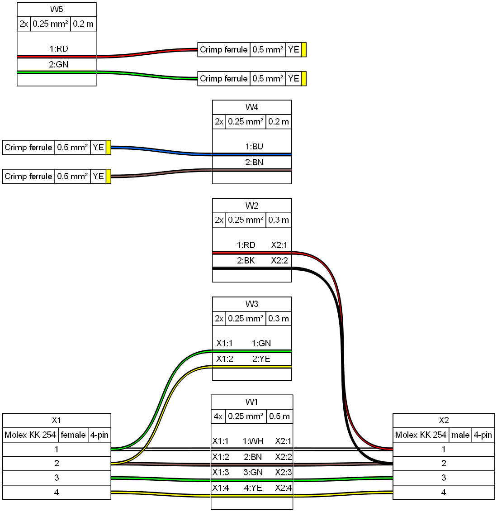

[Source](tutorial09.yml) - [Bill of Materials](tutorial09.bom.tsv)


## 10 - Custom color codes: looping and clipping

* Named color codes: DIN, IEC, BW, TEL, TELALT, T568A, T568B
* Clipping — fewer wires than palette colors: first N colors used
* Looping — more wires than palette colors: palette repeated as needed


```yaml
connectors:
  X1:
    pincount: 3
    type: Molex KK 254
    subtype: female
  X2:
    pincount: 3
    type: Molex KK 254
    subtype: male
  X3:
    pincount: 5
    type: Molex KK 254
    subtype: female
  X4:
    pincount: 5
    type: Molex KK 254
    subtype: male
  X5:
    pincount: 4
    type: Molex KK 254
    subtype: female
  X6:
    pincount: 4
    type: Molex KK 254
    subtype: male

cables:
  W1: # clipping: IEC has 10 colors, only the first 3 are used (BN, RD, OG)
    wirecount: 3
    length: 0.3
    gauge: 0.25 mm2
    color_code: IEC
  W2: # looping: BW has 2 colors, repeated 3 times and clipped (BK, WH, BK, WH, BK)
    wirecount: 5
    length: 0.3
    gauge: 0.25 mm2
    color_code: BW
  W3: # neither: DIN has 60 colors, exactly the first 4 are used
    wirecount: 4
    length: 0.3
    gauge: 0.25 mm2
    color_code: DIN

connections:
  -
    - X1: [1-3]
    - W1: [1-3]
    - X2: [1-3]
  -
    - X3: [1-5]
    - W2: [1-5]
    - X4: [1-5]
  -
    - X5: [1-4]
    - W3: [1-4]
    - X6: [1-4]
```

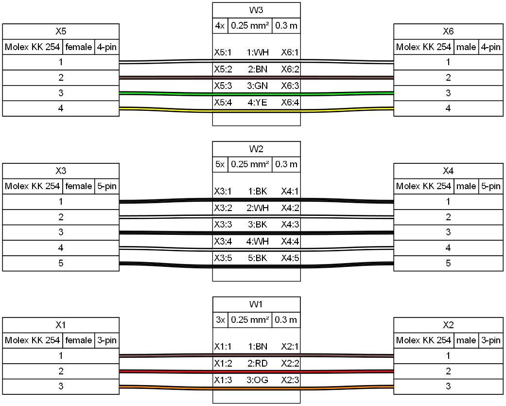

[Source](tutorial10.yml) - [Bill of Materials](tutorial10.bom.tsv)


## 11 - Merging multiple templates

* Merge two or more anchors with a list merge key: `<<: [*t1, *t2]`
* Later keys override earlier ones


```yaml
connectors:
  X1: &template_con # base connector template
    type: Molex KK 254
    subtype: female
    pincount: 4
  X2: &template_pins # shared pinout template
    pinlabels: [GND, VCC, SCL, SDA]
    notes: from shared pinout template
  X3:
    <<: [*template_con, *template_pins] # merge both templates
    notes: merged from two templates # override one of the merged values

cables:
  W1:
    wirecount: 4
    length: 1
    gauge: 0.25 mm2
    color_code: IEC
  W2:
    wirecount: 4
    length: 1
    gauge: 0.25 mm2
    color_code: DIN

connections:
  -
    - X1: [1-4]
    - W1: [1-4]
    - X3: [1-4]
  -
    - X1: [1-4]
    - W2: [1-4]
    - X2: [1-4]
```

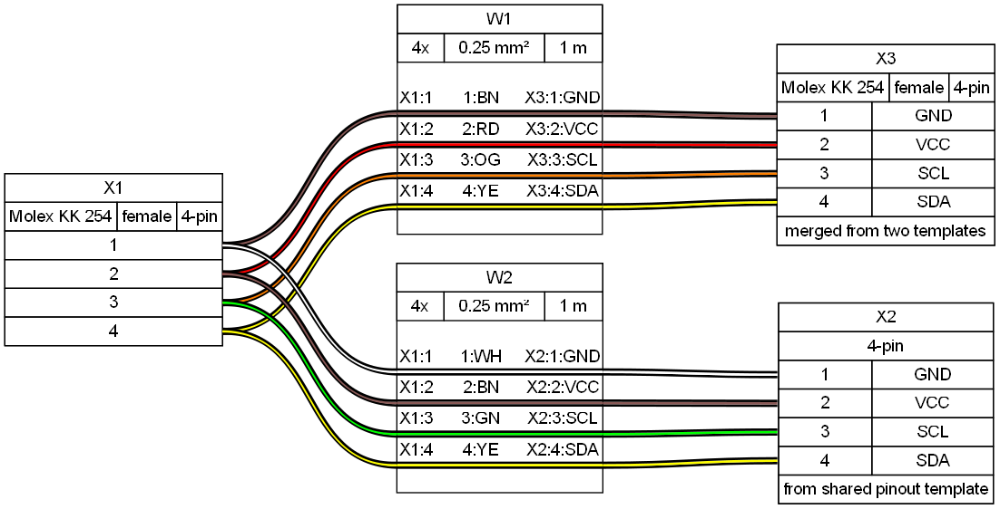

[Source](tutorial11.yml) - [Bill of Materials](tutorial11.bom.tsv)
